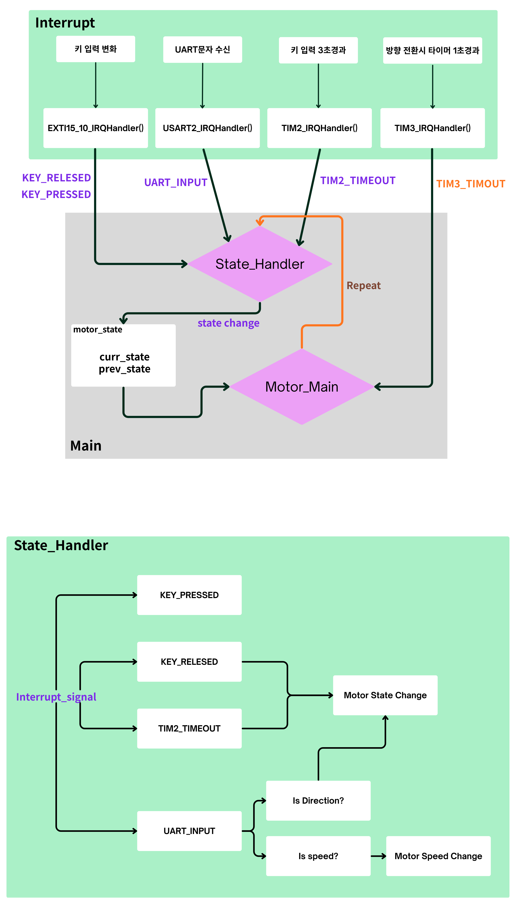
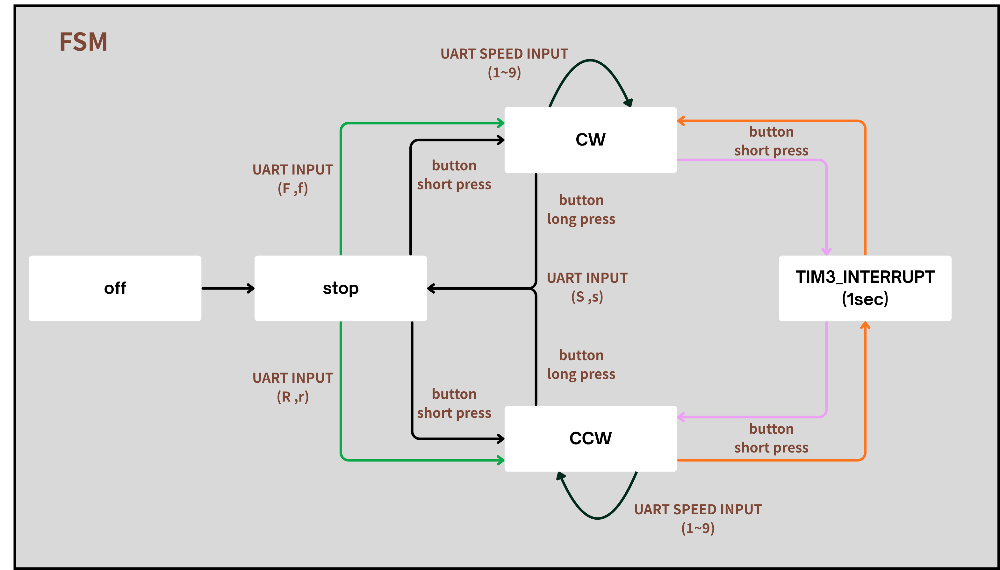

# 상위 설계서


## 목차

- [구현 목표 및 개요](#구현-목표-및-개요)
  - [1. 프로젝트 개요](#1-프로젝트-개요)
  - [2. 개발 환경 및 사양](#2-개발-환경-및-사양)
- [요구사항 정의](#요구사항-정의)
  - [1. 기능 요구사항](#1-기능-요구사항)
  - [2. 비기능 요구사항](#2-비기능-요구사항)
  - [3. 제약사항](#3-제약사항)
- [시스템 아키텍처](#시스템-아키텍처)
  - [1. 시스템 동작 흐름도 (Flowchart)](#1-시스템-동작-흐름도-flowchart)
  - [2. 상태 전이도 (State Machine Diagram)](#2-상태-전이도-state-machine-diagram)
- [하드웨어 설계](#하드웨어-설계)
  - [1. 사용 부품](#1-사용-부품)
  - [2. Pin Assignment](#2-pin-assignment)
- [소프트웨어 설계](#소프트웨어-설계)
  - [1. 모듈 구조 및 파일 목록](#1-모듈-구조-및-파일-목록)
  - [2. 이벤트 목록](#2-이벤트-목록)
  - [3. 발생 인터럽트 목록](#3-발생-인터럽트-목록)
  - [4. 변수 설정](#4-변수-설정)
  - [5. 함수 설정](#5-함수-설정)
  - [6. main.c - 메인함수 상세](#6-mainc---메인함수-상세)
  - [7. exception.c - 인터럽트 제어 상세](#7-exceptionc---인터럽트-제어-상세)
  - [8. motor.c - 레지스터 기반 모터 제어 상세](#8-motorc---레지스터-기반-모터-제어-상세)
## 구현 목표 및 개요

### 1. 프로젝트 개요

본 프로젝트는 STM32F4(ARM Cortex-M4) 기반 보드와 L293 모터
드라이버를 이용하여 DC 모터의 정방향 회전, 역방향 회전, 정지 및
PWM 속도 제어 기능을 구현하는 것을 목표로 한다.

### 2. 개발 환경 및 사양

| 구분 | 항목 | 내용 및 사양 | 비고 |
| :--- | :--- | :--- | :--- |
| HW | MCU | STM32F4(ARM Cortex-M4) | |
| HW | Motor Driver | L293 | |
| HW | Actuator | DC Motor | |
| HW | UART/Power Module | CP2102 Module | 모터 전원 공급 |
| SW | Language | C | |
| SW | IDE | Visual Studio Code | |


## 요구사항 정의

### 1. 기능 요구사항

#### 1.1 버튼 제어

- 시스템 초기화가 완료될 때까지 모터는 정지 상태를 유지해야 한다.
- 버튼을 3초 미만으로 눌렀다가 놓으면 모터의 회전 방향을 변경해야 한다.
- 버튼을 3초 이상 누르면 모터를 정지해야 한다.

#### 1.2 UART 제어

- `F` 또는 `f`를 수신하면 모터를 정방향(`CW`)으로 구동해야 한다.
- `R` 또는 `r`을 수신하면 모터를 역방향(`CCW`)으로 구동해야 한다.
- `S` 또는 `s`를 수신하면 모터를 정지해야 한다.
- `1`부터 `9`까지의 숫자를 수신하면 입력 단계에 따라 모터의
  PWM Duty를 변경해야 한다.
- 정의되지 않은 UART 명령은 무시해야 한다.

#### 1.3 방향 전환 보호

- 모터가 회전 중인 상태에서 반대 방향으로 전환될 경우 즉시
  역회전하지 않아야 한다.
- 모터를 먼저 정지시킨 후 1초가 지나면 반대 방향으로 구동해야 한다.

### 2. 비기능 요구사항

- 버튼 및 UART 입력 처리와 방향 전환을 위한 1초 정지 구간에도
  메인 루프는 중단되지 않고 지속적으로 동작해야 한다.
- 모터의 급격한 방향 전환으로 인한 과전류 발생과 모터 드라이버의
  손상을 방지해야 한다.

### 3. 제약사항

- L293의 모터 전원은 CP2102 모듈의 `+3.3V` 또는 `+5V`를 이용하여
  연결해야 한다.
- PWM 주파수와 PWM Duty Rate는 실험을 통해 적절한 값으로 설정해야 한다.
- PWM Duty Rate가 너무 낮으면 모터가 구동되지 않을 수 있으므로,
  Duty 범위는 `50%~100%`로 제한해야 한다.


## 시스템 아키텍처

### 1. 시스템 동작 흐름도 (Flowchart)

### 2. 상태 전이도 (State Machine Diagram)


## 하드웨어 설계


### 1. 사용 부품
- **MCU**: STM32 M4 Board
- **Motor Driver**: L293 Driver IC
- **Actuator**: DC Motor

### 2. Pin Assignment

| Peripheral | Pin / Channel | 역할 (Function) |
| :--- | :--- | :--- |
| **GPIO Pin** | PA0 | Motor Driver Line 1 (1A) / TIM5 CH1 |
| **GPIO Pin** | PA1 | Motor Driver Line 2 (2A) / TIM5 CH2 |
| **EXTI** | PC13 | Push Button (Falling / Rising Edge 감지) |
| **USART2** | PA2 (TX), PA3 (RX) | Baudrate 115200 외부 시리얼 명령어 수신 |
| **TIM2** | Internal | 3초 Long Press 감지용 One-shot Timer |
| **TIM3** | Internal | 방향 전환 시 1초 비동기 딜레이 체크용 Repeat Timer |
| **TIM5** | Internal | PA0, PA1 PWM Signal Generator (AF02) |


## 소프트웨어 설계

### 1. 모듈 구조 및 파일 목록

| 파일  | 역할 (Function) |
| :--- | :--- |
|main.c|메인 루프 동작|
|exception.c|인터럽트 예외처리|
|timer.c|타이머2,3,5 설정|
|uart.c|uart통신 설정|
|motor.c|모터제어 설정|
|key.c|버튼 설정|
|device_driver.h|공통헤더파일|


### 2. 이벤트 목록
| 이벤트 구분 | 이벤트 | 발생 조건 | 처리 내용 | 상태 변화 |
| :--- | :--- | :--- | :--- | :--- | 
|None|없음||||
|Key|`Key_Pressed`|키를 눌렀을 때|`short`, `long` 입력인지 판단을 위한 3초 측정을 시작한다.||
|Key|`Key_Relesed`|키를 땠을 때|`short` 입력으로 판단하면 다음 회전 방향을 결정하고 long입력으로 판단하면 넘어간다|`short`= `CW ↔ CCW`, `long` = 넘어감|
|Timer|`TIMER2_OUT`|3초가 지났을 때|3초가 지나도록 키를 누르고 있으면 `long` 입력으로 판단 ||
|UART|`UART_INPUT`|UART로 입력이 들어 왔을 때|입력 데이터에 따라 모터상태 변경 or 속도변경||


### 3. 발생 인터럽트 목록
- **EXTI15_10_ISR**: PC13 비트를 확인하여 Key Push 시 `TIM2` 스타트, Key Release 시 `TIM2` 스탑 및 Short Press 판단

- **TIM2_ISR**: 3초 이상 누르고 있을 경우 `is_long_pressed = 1` 및 `TIMER2_OUT` 이벤트 발생

- **TIM3_ISR**: 1초 지연 인터럽트 발생 시 `TIM3_Expired = 1` 플래그 세팅

- **USART2_ISR**: 수신 데이터 유형 분류 (`1`: 방향 명령어, `2`: 속도 단계)

### 4. 변수 설정 

| 파일명             | 구분     | 특수키워드    | 타입         | 변수(상수)명             | 초기값                         | 역할                     |
| --------------- | ------ | -------- | ---------- | ------------------- | ---------------------------------------- | ---------------------- |
| device.driver.h | 정의     |          |            | PWM_INPUT_FREQ      | 10000                                    | PWM 파형 주파          |
| device.driver.h | 정의     |          |            | MOTOR_SPEED_INIT    | 50                                       | 모터 초기              |
| device.driver.h | 정의     |          |            | MOTOR_SPEED_UP      | 5                                        | 모터 속도 증가 단위     |
| device.driver.h | 메크로    |          |            | MOTOR_SPEED_STEP(x) | MOTOR_SPEED_INIT + (MOTOR_SPEED_UP \* x) | 모터속도 자동 계산             |
| timer.c         | 정의     |          |            | TIM2_TICK           | 20                                       | Timer2 한 클록의 시간(usec)   |
| timer.c         | 정의     |          |            | TIM2_FREQ           | 1000000/TIM2_TICK                        | Timer2 주파수 50000Hz        |
| timer.c         | 정의     |          |            | TIM2_PLS_OF_1ms     | 1000/TIM2_TICK                           | Timer2의 1ms당 클록 수 (50)   |
| timer.c         | 정의     |          |            | TIM2_MAX            | 0xffffu                                  | Timer2에서 ARR에 저장되는 최대값|
| timer.c         | 정의     |          |            | TIM2_INIT           | 3000                                     | 3초                     |
| timer.c         | 정의     |          |            | TIM3_TICK           | 20                                       | Timer3 한 클록의 시간(usec)   |
| timer.c         | 정의     |          |            | TIM3_FREQ           | 1000000/TIM3_TICK                        | Timer3 주파수 50000Hz   |
| timer.c         | 정의     |          |            | TIM3_PLS_OF_1ms     | 1000/TIM3_TICK                           | Timer3의 1ms당 클록 수 (50)  |
| timer.c         | 정의     |          |            | TIM3_1sec           | 1000                                     | 1초                     |
| timer.c         | 정의     |          |            | TIM5_TICK           | 20                                       | Timer5 한 클록의 시간(usec) |
| timer.c         | 정의     |          |            | TIM5_FREQ           | 1000000/TIM5_TICK                        | Timer5 주파수 50000Hz   |
| timer.c         | 정의     |          |            | TIM5_PLS_OF_1ms     | 1000/TIM5_TICK                           | Timer5의 1ms당 클록 수 (50) |


| 파일명             | 구분   | 구조체 타입  | 상수명     |
| --------------- | ------ | ---------- | ------------     |
| device_driver.h | 상태 구조체 | eventState | NONE         |
| device_driver.h | 상태 구조체 | eventState | KEY_PRESSED  |
| device_driver.h | 상태 구조체 | eventState | KEY_RELEASED |
| device_driver.h | 상태 구조체 | eventState | UART_INPUT   |
| device_driver.h | 상태 구조체 | eventState | TIMER2_OUT   |
| device_driver.h | 상태 구조체 | MotorState | MOTOR_STOP   |
| device_driver.h | 상태 구조체 | MotorState | MOTOR_CW     |
| device_driver.h | 상태 구조체 | MotorState | MOTOR_CCW    |

| 파일명    | 구분    | 특수 키워드   | 타입    | 변수명             | 초기값  | 역할                       |
| ------ | ----- | -------- | ------------- | ----------------- | ---- | ------------------------ |
| main.c | 상태변수  |          | eventState    | event             | NONE | 어떤 이벤트가 발생했는지            |
| main.c | 상태변수  | volatile | int           | is_long_pressed   | 0    | 키가 3초이상 눌렸는지             |
| main.c | 상태변수  | volatile | int           | is_key_pressed    | 0    | 키를 누르고 있는 상태인지           |
| main.c | 상태변수  | volatile | int           | uart_data_in      | 0    | uart로 데이터가 들어왔다면 무슨 타입인지 |
| main.c | 데이터변수 | volatile | unsigned char | input_motor_dir   | 0    | 모터가 어떤 방향인지                   |
| main.c | 데이터변수 | volatile | int           | input_motor_speed | 0    | Uart로 요청한 모터 속력               |


| 파일명    | 구분    | 특수 키워드   | 타입      | 변수명          | 초기값  | 역할                       |
| ------ | ----- | -------- | ------------- | ----------------- | ---- | ------------------------ |
| motor.c         | 상태변수   | static   | MotorState | running_state       | MOTOR_STOP                               | 현재 동작하는 상태를 저장         |
| motor.c         | 플래그 변수 | volatile | int        | TIM3_Expired        | 0                                        | 타이머3번이 타임아웃됬는지 확인하는 변수 |

### 5. 함수 설정 
| 파일명 | 타입 | 함수이름 | 매개변수 | 반환값 | 역할 |
| :--- | :--- | :--- | :--- | :--- | :--- |
| **uart.c** | 함수 | Uart2_Init | int baud | void | UART2 통신 속도(Baud rate) 초기화 |
| **uart.c** | 함수 | Uart2_RX_Interrupt_Enable | int en | void | UART2 수신 인터럽트 활성화/비활성화 |


| 파일명 | 타입 | 함수이름 | 매개변수 | 반환값 | 역할 |
| :--- | :--- | :--- | :--- | :--- | :--- |
| **key.c** | 함수 | Key_Init | void | void | 키/버튼 입력을 위한 GPIO 초기화 |
| **key.c** | 함수 | Key_ISR_Enable | int en | void | 키 인터럽트(EXTI) 활성화/비활성화 |


| 파일명 | 타입 | 함수이름 | 매개변수 | 반환값 | 역할 |
| :--- | :--- | :--- | :--- | :--- | :--- |
| **timer.c** | 함수 | Timer2_Init | void | void | 타이머 2 초기화 |
| **timer.c** | 함수 | Timer2_Start | void | void | 타이머 2 동작 시작 |
| **timer.c** | 함수 | Timer2_Stop | void | void | 타이머 2 동작 정지 |
| **timer.c** | 함수 | TIM2_Interrupt_Enable | int en | void | 타이머 2 인터럽트 활성화/비활성화 |
| **timer.c** | 함수 | TIM3_Repeat_Interrupt_Enable | int en | void | 타이머 3 반복 인터럽트 활성화/비활성화 |
| **timer.c** | 함수 | Timer5_Init | void | void | 타이머 5 초기화 |
| **timer.c** | 함수 | Timer5_Out_Pwm_Generator | int duty | void | 지정한 듀티비(Duty Cycle)로 타이머 5 PWM 출력 제어 |


| 파일명 | 타입 | 함수이름 | 매개변수 | 반환값 | 역할 |
| :--- | :--- | :--- | :--- | :--- | :--- |
| **motor.c** | 함수 | Motor_Init | void | void | 모터 제어 신호 및 핀 초기화 |
| **motor.c** | 함수 | Motor_Main | void | void | 모터 동작 메인 루틴 |
| **motor.c** | 함수 | Long_key_motor_state | void | void | 키 입력 지속 시간에 따른 모터 상태 전환 |
| **motor.c** | 함수 | Motor_ProcessKeyState | void | void | 키 입력 상태에 따른 모터 동작 제어 |
| **motor.c** | 함수 | Motor_ProcessUartState | char data | void | UART 수신 데이터에 따른 모터 동작 제어 |
| **motor.c** | 함수 | Motor_Stop | void | void | 모터 동작 정지 |
| **motor.c** | 함수 | Motor_RotateCW | void | void | 모터 시계 방향(CW) 회전 |
| **motor.c** | 함수 | Motor_RotateCCW | void | void | 모터 반시계 방향(CCW) 회전 |


| 파일명 | 타입 | 함수이름 | 매개변수 | 반환값 | 역할 |
| :--- | :--- | :--- | :--- | :--- | :--- |
| **exception.c** | ISR | EXTI15_10_IRQHandler | void | void | 외부 인터럽트(버튼) 서비스 루틴 |
| **exception.c** | ISR | TIM2_IRQHandler | void | void | 타이머 2 인터럽트 서비스 루틴 |
| **exception.c** | ISR | TIM3_IRQHandler | void | void | 타이머 3 인터럽트 서비스 루틴 |
| **exception.c** | ISR | USART2_IRQHandler | void | void | USART2 통신 인터럽트 서비스 루틴 |

### 6. main.c - 메인함수 상세
```c
for(;;)
{
    ---------------------------------------------------------------------
	state_handler()
		- if(이벤트 == None)  return
		
		- else if(이벤트 == Key Pressed)
			event = None
			
		- else if(이벤트 == timer2_out)
			길게 눌렀을때 함수
			event = None
			
		- else if(이벤트 == Key released)
			if (!is_long_pressed)
			  Motor_ProcessKeyState(); 
			  Timer5_Out_Pwm_Generator(MOTOR_SPEED_STEP(0));
			  
			event = None
			
		- if (이벤트 == uart 입력 플래그 변수)
				if 플래그 1
					Motor_ProcessUartState(INPUT_MOTOR_DIR)
				else if 플래그 2
					Timer5_Out_Pwm_Generator(MOTOR_SPEED_STEP(INPUT_MOTOR_SPEED))	
				event = None
	---------------------------------------------------------------------	
	
	motor_main();

}

```


### 7. exception.c - 인터럽트 제어 상세
```c
---------------------------------------------------------------------
타이머 3번 인터럽트
3번 타이머 를 써서  1초 체크되면 1
---------------------------------------------------------------------
키인터럽트

    키눌렀을때 인터럽트
    - 이벤트 = KEY_PRESSED
    - is_key_pressed = 1
    - is_long_pressed = 0
    - 타이머2 3초 스타트
    
    키뗐을때 인터럽트
    - 이벤트상태 = KEY_RELEASED
    - is_key_pressed = 0
    - 타이머2 스톱
---------------------------------------------------------------------
3초가 지났을때 인터럽트
- if (is_key_pressed) {
			이벤트 = timer2_out
			is_long_pressed=1
  }
--------------------------------------------------------------------- 
UART가 들어왔을때 인터럽트
if 일단 입력받은거를   ('S''s' / 'F''f' / 'R''r') 이거면 
- INPUT_MOTOR_DIR = DR
- 플래그 1

else if 입력이 숫자 1~9라면 
- INPUT_MOTOR_SPEED = DR
- 플래그 2

else
아니라면 플래그 0으로
```


### 8. motor.c - 레지스터 기반 모터 제어 상세
```c
PA0, PA1 alternate_mode 사용시
타이머 5번의 1,2번 채널을 사용한다

===정지상태일때=== Motor_Stop
GPIOA->MODER => 0번핀 1번 핀 모두 01 01
GPIO->ODR => 0;

====1 0일때===== //Motor_RotateCW
GPIOA->MODER => 10 01 //한쪽만 주변장치모드로 해서 타이머 5번의 주파수를 출력해야한다
GPIOA->AFR[0] => 4번비트에 2(타이머 5번)를 줘야한다
GPIO->ODR =>  0번비트에 0
TIM5->CCMR1 -> pwm모드(14~12번비트) 110고정

====0 1일때===== //Motor_RotateCCW
GPIOA->MODER => 01 10
GPIOA->AFR[0] => 0번자리에 2(타이머 5번)를 줘야한다 
GPIO->ODR =>  1번비트에 0
TIM5->CCMR1 -> pwm모드(4~6번비트) 110고정

---------------------------------------------------------------------
Long_key_motor_state()
prev = curr
curr = stop

---------------------------------------------------------------------
Motor_ProcessKeyState()
curr -> 현재 돌고 있는 상태
prev -> 이전에 돌고있던 상태

우리는 curr을 보고 버튼을 눌렀을때 curr 반대방향으로 방향이 바뀐다는점

1. curr == stop
	1-1. if 처음 상태라면  prev == stop
			 curr = cw, prev = cw
			 
	1-2. else if prev == cw
				curr_state = cw;
        prev_state = stop;
        
  1-3. else if prev == ccw
				curr_state = ccw;
        prev_state = stop
        
2. curr == cw
	2-1 curr == cw, prev == ccw -> curr = ccw, prev = cw 저장

3. curr == ccw
	3-1 curr == ccw, prev == cw -> curr = cw, prev = ccw 저장

 
--------------------------------------------------------------------- 
Motor_ProcessUartState(INPUT_DATA)
prev = curr
if F 
- curr = cw 

else if s
- curr = stop

else if r
- curr = ccw
```